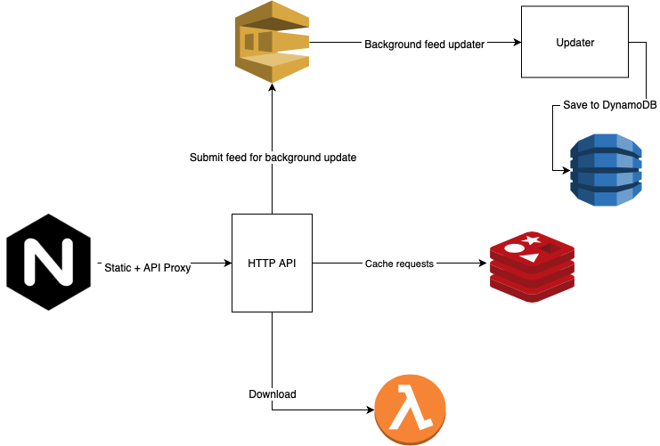

# Podsync


[](https://travis-ci.com/mxpv/podsync)
[](https://goreportcard.com/report/github.com/mxpv/podsync)
[](https://www.patreon.com/podsync)

Podsync - is a simple, free service that lets you listen to any YouTube / Vimeo channels, playlists or user videos in podcast format.

Podcast applications have a rich functionality for content delivery - automatic download of new episodes, remembering last played position, sync between devices and offline listening. This functionality is not available on YouTube and Vimeo. So the aim of Podsync is to make your life easier and enable you to view/listen to content on any device in podcast client.

## Architecture



## Building Docker images

Every project contains a `Makefile` for building and pushing to a registry:

```bash
make build
make push
make update
```

Use docker-compose to run containers:

```bash
docker-compose pull
docker-compose up -d
```

## Building frontend
Node.js and npm are required in order to build the frontend:
```bash
brew install node
make static
ls -la dist/
```
