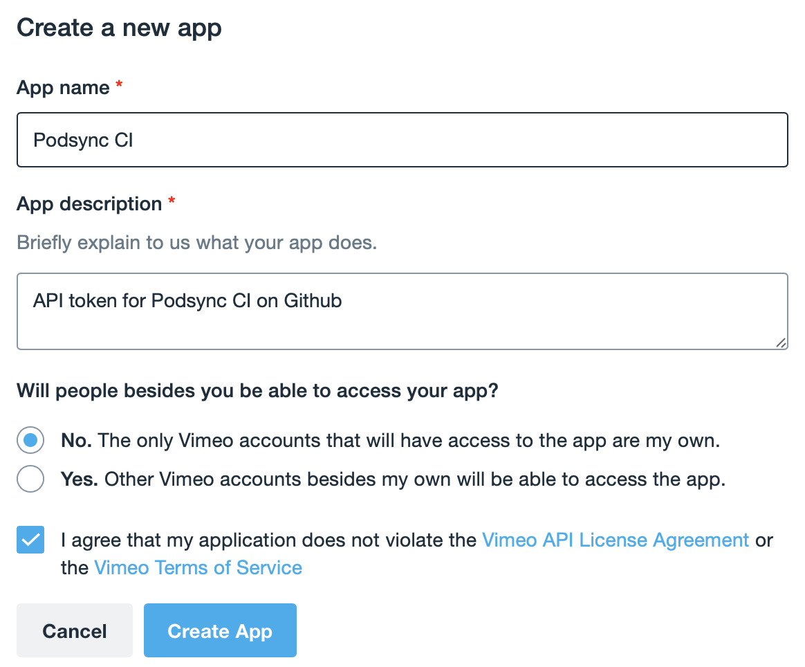
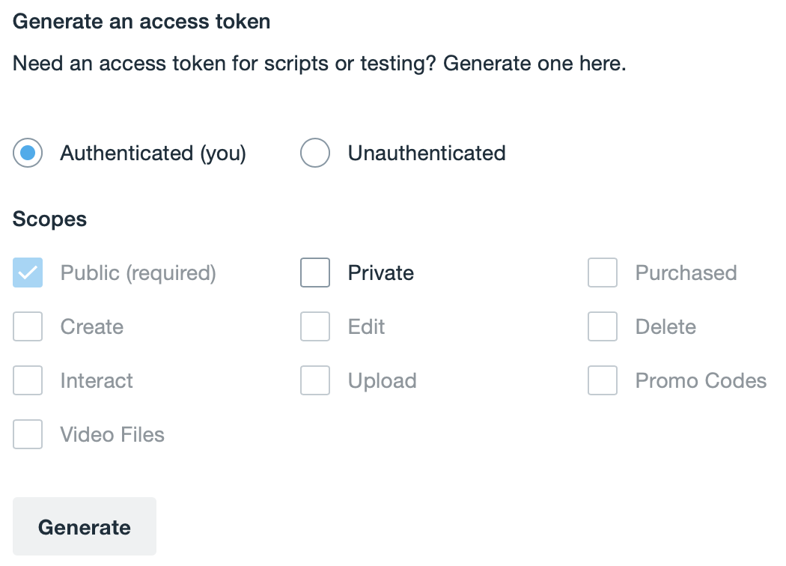
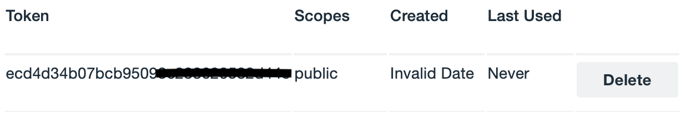

# How to get Vimeo API token

1. Create an account on https://vimeo.com
2. Navigate to https://developer.vimeo.com
3. Click `New app` button.

4. Click `Create App`.
5. Navigate to [Generate an access token](https://developer.vimeo.com/apps/160740#generate_access_token) section.

6. Click `Generate`.

7. Copy a token to your CLI's configuration file or set it as an environment variable.
```toml
[tokens]
vimeo = "ecd4d34b07bcb9509ABCD"
```
Or set the environment variable:
```sh
export PODSYNC_VIMEO_API_KEY="ecd4d34b07bcb9509ABCD"
```

For API key rotation, you can specify multiple keys separated by spaces:
```sh
export PODSYNC_VIMEO_API_KEY="ecd4d34b07bcb9509ABCD fdc5e45c18cda0610EFGH"
```
