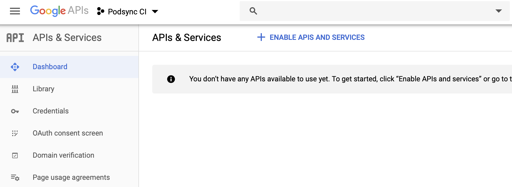
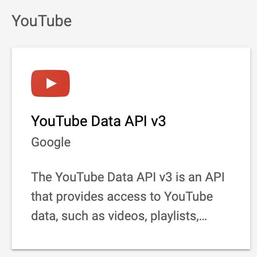
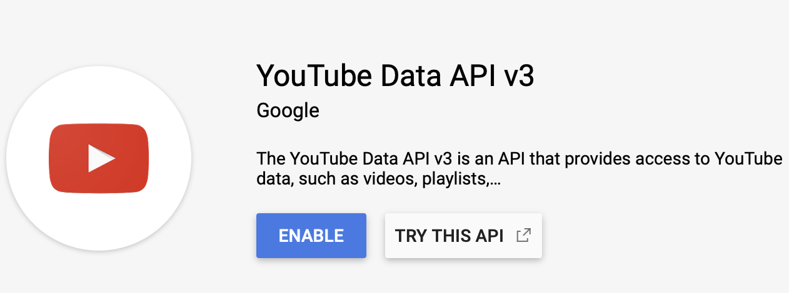
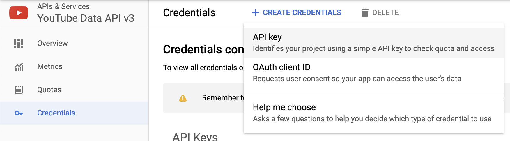

# How to get YouTube API Key

1. Navigate to https://console.developers.google.com
2. Click `Select a project`.

3. Click `New project`.

4. Give it a name and click `Create` button.

5. Click `Library`, find and click on `YouTube Data API v3` box.

6. Click `Enable`.

5. Click `Credentials`.
6. Click `Create credentials`.
7. Select `API key`.

8. Copy token to your CLI's configuration file or set it as an environment variable:

```toml
[tokens]
youtube = "AIzaSyD4w2s-k79YNR98ABC"
```
Or set the environment variable:
```sh
export PODSYNC_YOUTUBE_API_KEY="AIzaSyD4w2s-k79YNR98ABC"
```

For API key rotation, you can specify multiple keys separated by spaces:
```sh
export PODSYNC_YOUTUBE_API_KEY="AIzaSyD4w2s-k79YNR98ABC AIzaSyD4w2s-k79YNR98DEF"
```